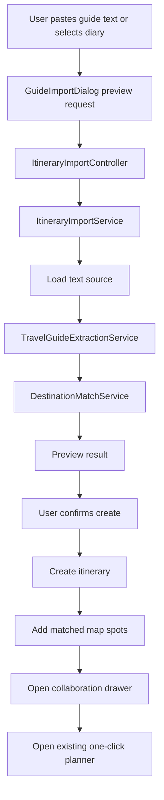

# Guide Import Itinerary Design

## Goal

Add an itinerary import feature that turns free-form travel guide text or an existing in-system travel diary into a new collaborative itinerary. The system extracts core places, visit order, rough stay duration, and useful notes through a backend LLM-assisted pipeline, matches extracted places to existing destination records, creates a new itinerary, adds matched spots as map candidates, and opens the existing one-click planner for route preview.

This spec covers the MVP scope approved for this iteration:

- Paste text travel guide input.
- Select an existing travel diary as input.
- Automatically create a new collaborative itinerary after import.
- Reuse the existing itinerary collaboration and one-click planner modules.

External webpage URL scraping, OCR, document upload, and full multi-day schedule persistence are out of scope.

## Existing System Context

The project already has the main pieces needed for this workflow:

- Frontend: Vue 3, Vite, Element Plus, `data-structure-design-frontend/src/views/ItineraryView.vue`, and `data-structure-design-frontend/src/views/DiaryView.vue`.
- Backend: Spring Boot services/controllers under `data-structure-design-backend/src/main/java/com/travel/system`.
- LLM proxy: `TravelAgentService`, `TravelAgentController`, `LlmChatClient`, and `SiliconFlowChatClient` already keep API credentials on the backend.
- Itinerary creation and collaboration: `ItineraryService`, `ItineraryController`, map spot candidate APIs, WebSocket collaboration, and tactical map UI.
- Route preview: `POST /api/itinerary-planner/preview`, `ItineraryPlannerService`, `ItineraryPlannerPanel.vue`, and `useItineraryPlanner.js`.
- Diary source data: diary list/detail APIs and diary content already exist.

The import feature should not introduce a separate route-planning implementation. It should produce normalized planner spots and hand off to the existing collaboration and planner workflow.

## User Workflow

1. User opens the itinerary page.
2. User clicks a new "Import guide" action.
3. A guide import dialog opens with two source modes:
   - Paste guide text.
   - Select an existing travel diary.
4. User provides text or chooses a diary.
5. User clicks "Recognize".
6. The frontend calls a backend preview endpoint.
7. Backend extracts structured itinerary intent and matches extracted place names to existing destinations.
8. Dialog displays:
   - Suggested itinerary title.
   - Summary.
   - Ordered matched spots.
   - Stay duration suggestions.
   - Unmatched places and warnings.
9. User clicks "Generate itinerary".
10. Backend creates a new collaborative itinerary and adds matched destination candidates.
11. Frontend opens the new itinerary's collaboration drawer.
12. Frontend expands the existing one-click planner panel with the imported spots ready for preview.

## Recommended Architecture

Use a backend import pipeline with two public endpoints:

- `POST /api/itinerary-import/preview`
- `POST /api/itinerary-import/create`

The preview endpoint performs extraction and matching without writing itinerary data. The create endpoint performs the same import flow and persists a new itinerary plus matched map spot candidates.

The main backend services:

- `ItineraryImportService`
  - Orchestrates source loading, extraction, matching, preview response construction, and create flow.
- `TravelGuideExtractionService`
  - Calls the configured LLM through the existing backend LLM client.
  - Parses strict JSON output into typed DTOs.
  - Falls back to local extraction when LLM is unavailable or returns invalid output.
- `DestinationMatchService`
  - Matches extracted place names to existing `Destination` records.
  - Uses exact name match first, then normalized fuzzy match/search.
  - Records confidence and unmatched places.
- Existing `DiaryService`
  - Loads diary content when `sourceType` is `DIARY`.
- Existing `ItineraryService`
  - Creates the new collaborative itinerary.
- Existing `ItinerarySpotCandidateService`
  - Adds matched destinations to the new itinerary map.
- Existing `ItineraryPlannerService`
  - Remains the only route preview implementation.

The main frontend pieces:

- `GuideImportDialog.vue`
  - Encapsulates the import UI and result preview.
- `ItineraryView.vue`
  - Hosts the import entry point.
  - Opens collaboration for the newly created itinerary.
  - Expands `ItineraryPlannerPanel` after creation.
- `travel.js`
  - Adds API methods for import preview and create.

## Backend API Contract

### Preview Import

`POST /api/itinerary-import/preview`

Request:

```json
{
  "sourceType": "TEXT",
  "text": "第一天去外滩和豫园，晚上逛南京路。第二天去上海博物馆和人民广场。",
  "diaryId": null,
  "owner": "游客"
}
```

Rules:

- `sourceType` is `TEXT` or `DIARY`.
- `text` is required for `TEXT`.
- `diaryId` is required for `DIARY`.
- `owner` is optional in preview and only used for display defaults.

Response:

```json
{
  "title": "上海两日经典路线",
  "summary": "围绕城市经典景点的轻量游览路线。",
  "sourceType": "TEXT",
  "spots": [
    {
      "rawName": "外滩",
      "matchedDestinationId": 12,
      "matchedName": "外滩",
      "latitude": 31.2397,
      "longitude": 121.4998,
      "dayIndex": 1,
      "orderIndex": 0,
      "stayMinutes": 90,
      "confidence": 0.92,
      "notes": "适合傍晚游览"
    }
  ],
  "unmatchedSpots": [
    {
      "rawName": "某网红咖啡馆",
      "dayIndex": 1,
      "orderIndex": 2,
      "reason": "No matching destination found"
    }
  ],
  "warnings": []
}
```

### Create From Import

`POST /api/itinerary-import/create`

Request:

```json
{
  "sourceType": "DIARY",
  "text": null,
  "diaryId": 8,
  "owner": "游客"
}
```

Response:

```json
{
  "itinerary": {
    "id": 101,
    "name": "上海两日经典路线",
    "owner": "游客"
  },
  "importResult": {
    "title": "上海两日经典路线",
    "summary": "围绕城市经典景点的轻量游览路线。",
    "spots": [],
    "unmatchedSpots": [],
    "warnings": []
  },
  "plannerSpots": []
}
```

Create rules:

- If no extracted places match destinations, do not create an itinerary.
- If at least one place matches, create an itinerary and add only matched destinations.
- Preserve unmatched places in the response as warnings.
- Use the extracted title when present; otherwise derive a title from the first matched place and current date.
- Use existing default strategy and transport mode unless extracted text strongly implies another mode.

## Extraction Rules

The LLM prompt must request strict JSON only. The output schema should include:

- `title`
- `summary`
- `places[]`
  - `name`
  - `dayIndex`
  - `orderIndex`
  - `stayMinutes`
  - `reason`
  - `confidence`

Prompt constraints:

- Extract only places present or clearly implied in the input.
- Preserve the travel order from the guide text.
- Infer `stayMinutes` conservatively:
  - Museum, park, campus, scenic area: 90-180 minutes.
  - Street, landmark, viewpoint: 45-90 minutes.
  - Meal or cafe stop: 45-75 minutes.
- If order is unclear, use text appearance order.
- If day grouping is unclear, use `dayIndex = 1`.
- Do not invent real-world facts or unavailable coordinates.
- Return low confidence instead of guessing.

LLM failure handling:

- If LLM is not configured, use local fallback extraction.
- If LLM call fails, use local fallback extraction and include a warning.
- If LLM returns invalid JSON, attempt one parse repair pass, then fallback.

Local fallback extraction:

- Load candidate destination names.
- Normalize text and destination names.
- Match destination names that appear in the input.
- Order matches by first occurrence in the text.
- Assign default `dayIndex = 1`.
- Assign default `stayMinutes = 120`.
- Confidence is `0.65` for exact text occurrence.

## Destination Matching

`DestinationMatchService` should match extracted place names in this order:

1. Exact match against destination name.
2. Case/space/punctuation normalized match.
3. Existing destination search by keyword.
4. Conservative fuzzy match only when the best candidate is clearly better than the second candidate.

The service returns:

- Matched destination id/name/coordinates.
- Match confidence.
- Unmatched reason when no destination is reliable.

Ambiguous matches should not be silently accepted. They should appear as unmatched or low-confidence warnings, so the user can adjust the text or manually add spots through the existing real spot search panel.

## Frontend Design

Add a compact import action to the itinerary page near existing refresh/search actions. The action opens `GuideImportDialog.vue`.

Dialog behavior:

- Two tabs: "Paste text" and "Choose diary".
- Paste mode:
  - Large text area.
  - Character count and basic empty-state validation.
- Diary mode:
  - Searchable diary list using existing diary APIs.
  - Selecting a diary shows title, author, destination, and excerpt.
- Preview state:
  - Shows ordered matched spots with confidence, stay minutes, and notes.
  - Shows unmatched spots in a warning section.
  - Allows user to cancel before creating.
- Create state:
  - Shows loading state while backend creates itinerary.
  - On success, closes dialog and opens the new collaboration drawer.

`ItineraryView.vue` integration:

- Add `importOpen`, `importLoading`, and `pendingImportedItineraryId` state as needed.
- Add `handleImportCreated(response)`:
  - Insert/update the created itinerary in the itinerary list.
  - Call existing `openCollaboration(response.itinerary)`.
  - Set `plannerOpen = true` after map spots load.
  - Store `plannerPreview = null` so the user generates a fresh preview.

The import dialog should not depend on collaboration internals. It emits the create response; the page decides how to open the itinerary.

## Data Flow



## Error Handling

- Empty text: frontend blocks submission.
- Missing diary id: frontend blocks submission.
- Diary not found: backend returns `404`.
- Diary private or unauthorized: backend returns `403` if ownership rules exist; otherwise keep existing diary access behavior.
- LLM not configured: backend returns fallback result with warning, not a hard error.
- LLM invalid output: backend fallback with warning.
- No matched destinations: backend returns `422` for create, with preview data and a clear warning.
- Partial matches: create succeeds with matched spots and returns unmatched warnings.
- Candidate add failure after itinerary creation: return `500` with created itinerary id and warning if partial recovery is possible; otherwise fail the transaction if implemented transactionally.

## Testing

Backend tests:

- `ItineraryImportService` extracts ordered places from pasted text using a stub LLM response.
- Diary source loads content and enters the same extraction pipeline.
- Invalid LLM JSON falls back to local extraction.
- Unconfigured LLM falls back to local extraction.
- Destination matching accepts exact names and rejects ambiguous matches.
- Create endpoint creates an itinerary and adds only matched destinations.
- Create endpoint refuses to persist when no spots match.

Frontend tests:

- Paste mode builds the expected preview request.
- Diary mode builds the expected preview request.
- Preview result renders matched spots, unmatched spots, and warnings.
- Create success calls the itinerary page handler.
- Itinerary page opens collaboration and expands planner after import.
- API errors keep the user's text or selected diary intact.

## Out Of Scope

- External webpage URL fetching and content extraction.
- Browser extension or current-webpage selection.
- Image OCR.
- PDF, Word, or Markdown file import.
- Persisting detailed day-by-day schedules beyond ordered map candidates.
- Hotel, restaurant, transport ticket, or budget planning.
- Automatic route preview generation without user confirmation in the planner panel.
